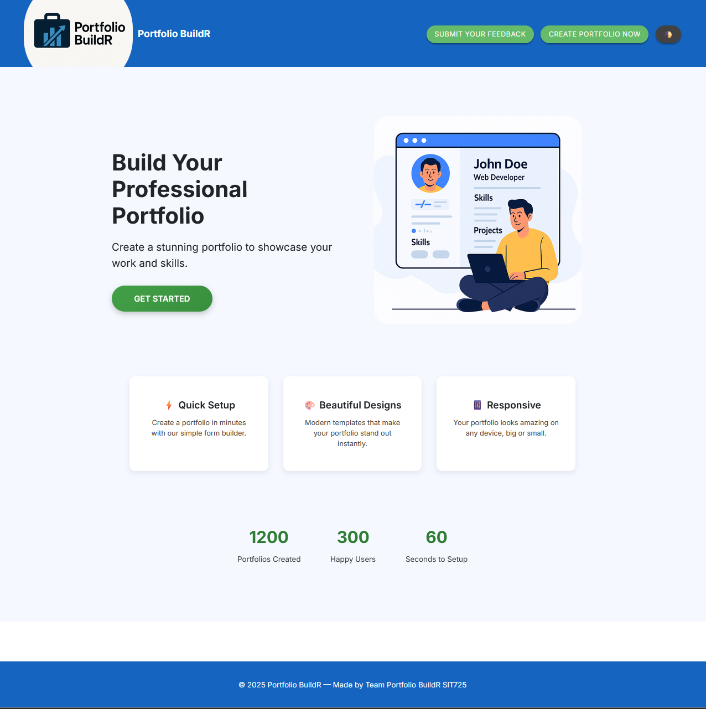
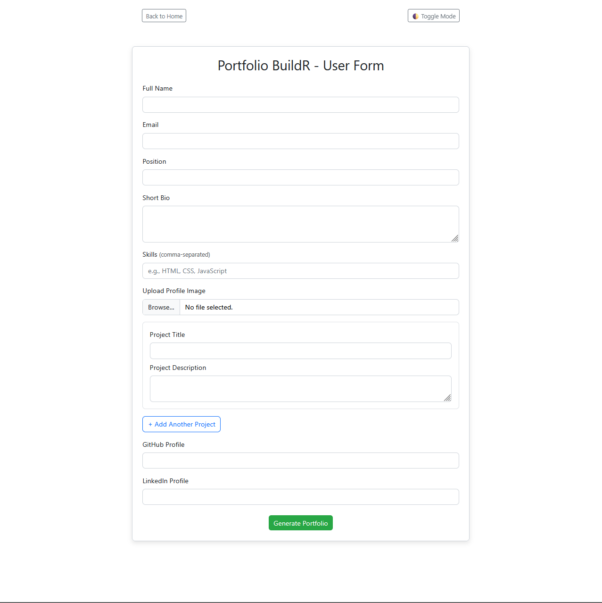
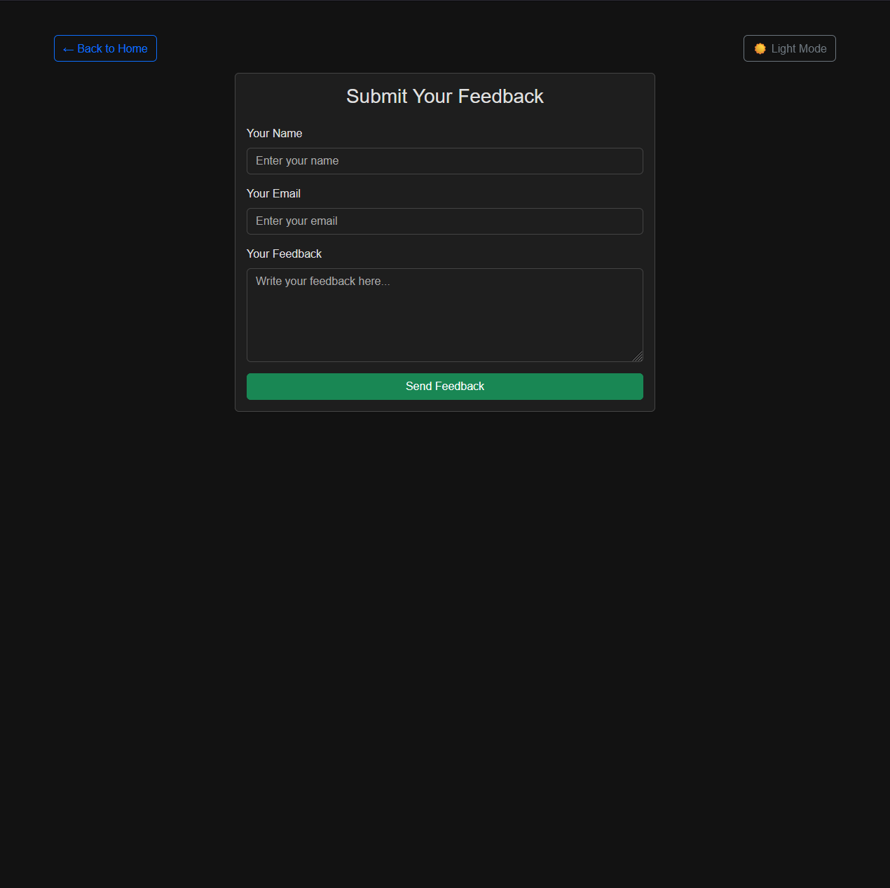
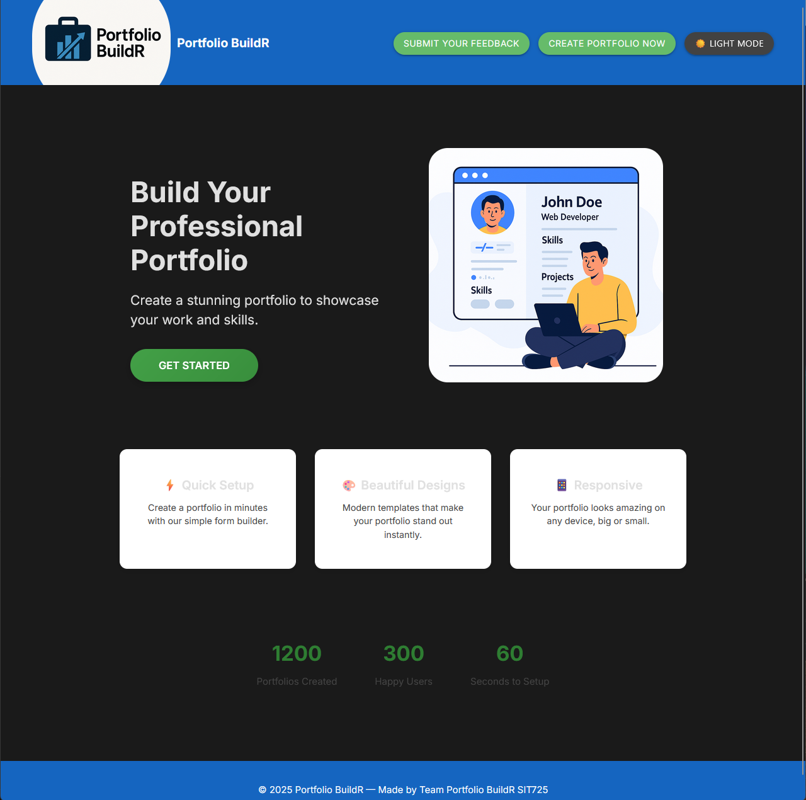

# Portfolio-BuildR
SIT725 group project for building a portfolio generator using Node.js, Express, MongoDB, EJS

## Team Members
- Pratik Khadka
- Abhishek Acharya

---
## Contributions
**Pratik Khadka** – Implemented theme selector, PDF generation, backend routes (download, feedback), enhanced portfolio rendering, integration testing.

**Abhishek Acharya** – Designed UI (homepage, form, feedback), integrated Mongoose database connection, implemented form validation, testing (UI + integration), and improved dark/light mode toggle across pages.

### Features

Dynamic Themes – Multiple color themes (Light, Dark, Blue, Green, Purple) with live preview.
Dark/Light Mode Toggle – Quick theme switch built with JavaScript.
PDF Generation – Export portfolio as a PDF using Puppeteer with selected theme applied.
Feedback System – Feedback form with storage and email integration.
Form Submission & File Uploads – Handles portfolio data and image uploads with Multer.
Express.js Backend – Modular routes (formRoute, downloadRoute, feedbackRoute).
MongoDB Integration – Portfolio data saved using Mongoose schema.
EJS Templates – Dynamic rendering for portfolio, feedback, and form pages.
Testing – Unit and integration tests using Jest & Supertest.
Responsive Design – Clean UI with Materialize CSS and custom theme.css.

---
## Design Prototype
The initial UI was designed in **Figma** before development.  
[View Figma Design](https://www.figma.com/design/JeCwgiN2igjwdjMq5HdOXI/Untitled?node-id=0-1&t=JLv0wYEgIOGfYWOW-1) 

## Folder Structure
portfolio-buildr/
│
├── public/
│   ├── css/
│   │   └── theme.css
│   ├── js/
│   │   ├── mailController.js
│   │   └── themeSelector.js
│   └── uploads/
│
├── views/
│   ├── index.ejs
│   ├── form.ejs
│   ├── portfolio.ejs
│   └── feedback.ejs
│
├── routes/
│   ├── formRoute.js
│   ├── downloadRoute.js
│   └── feedbackRoute.js
│
├── models/
│   └── Portfolio.js
│
├── tests/
│   ├── mailController.test.js
│   ├── portfolioModel.test.js
│   └── app.int.test.js
│
├── app.js
├── server.js
├── package.json
└── README.md

---

## How to Run the Project Locally
### 1️. Clone the Repository

Using bash use the commands:

1. `git clone https://github.com/yourusername/portfolio-buildr.git`
2. `cd portfolio-buildr`

## 2. Install dependencies
`npm install`

## 3. Run the Application
`npm start`
Using the link `http://localhost:3000` run the server

### Tech Used
Frontend: Materialize CSS, Custom CSS (themes), EJS templates
Backend: Node.js, Express.js
Database: MongoDB (Mongoose)
Testing: Jest, Supertest, jsdom
Other Tools: Puppeteer (PDF generation), Multer (file upload), Express-session

### Screenshots

### Homepage

### Portfolio Form

### Feedback Form

### Dark Mode UI

### Running Tests
Jest + Supertest are used for Unit and Integration Testing
Use the command : `npm test`

### Test Coverage
Our project uses **Jest** and **Supertest** for testing. The following test files are included:
 **Integration Tests**
  - `app.int.test.js` – Ensures the application and routes are running correctly.
  - `feedback.int.test.js` – Validates feedback form submission and backend integration.
  - `form.int.test.js` – Tests form submission, validation, and backend data handling.
- **UI Tests**
  - `form.ui.test.js` – Confirms form elements render correctly and validation triggers.
  - `homepage.ui.test.js` – Ensures homepage UI components (buttons, links, toggles) render and work.
- **Unit Tests**
  - `mailController.test.js` – Tests email/feedback submission logic.
  - `portfolioModel.test.js` – Tests database schema and Mongoose model validation.

### Future Improvements
Add authentication (login/register).
Improve PDF export with customizable layouts.
Save and manage multiple portfolios per user.
Allow feature to edit/resubmuit the portfolio.
